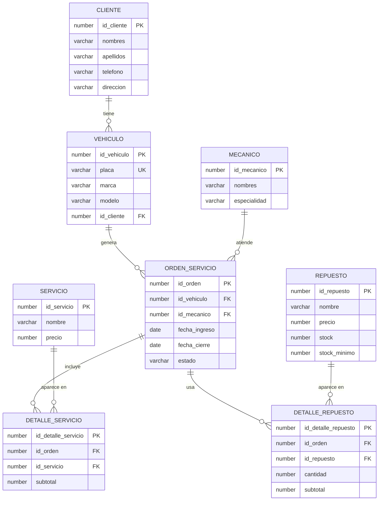

# Diagrama ER — Sistema AUTOFIX

```mermaid
erDiagram

    CLIENTE {
        number id_cliente PK
        varchar nombres
        varchar apellidos
        varchar telefono
        varchar direccion
    }

    VEHICULO {
        number id_vehiculo PK
        varchar placa UK
        varchar marca
        varchar modelo
        number id_cliente FK
    }

    MECANICO {
        number id_mecanico PK
        varchar nombres
        varchar especialidad
    }

    SERVICIO {
        number id_servicio PK
        varchar nombre
        number precio
    }

    REPUESTO {
        number id_repuesto PK
        varchar nombre
        number precio
        number stock
        number stock_minimo
    }

    ORDEN_SERVICIO {
        number id_orden PK
        number id_vehiculo FK
        number id_mecanico FK
        date fecha_ingreso
        date fecha_cierre
        varchar estado
    }

    DETALLE_SERVICIO {
        number id_detalle_servicio PK
        number id_orden FK
        number id_servicio FK
        number subtotal
    }

    DETALLE_REPUESTO {
        number id_detalle_repuesto PK
        number id_orden FK
        number id_repuesto FK
        number cantidad
        number subtotal
    }

    CLIENTE        ||--o{ VEHICULO          : "tiene"
    VEHICULO       ||--o{ ORDEN_SERVICIO    : "genera"
    MECANICO       ||--o{ ORDEN_SERVICIO    : "atiende"
    ORDEN_SERVICIO ||--o{ DETALLE_SERVICIO  : "incluye"
    ORDEN_SERVICIO ||--o{ DETALLE_REPUESTO  : "usa"
    SERVICIO       ||--o{ DETALLE_SERVICIO  : "aparece en"
    REPUESTO       ||--o{ DETALLE_REPUESTO  : "aparece en"
```
