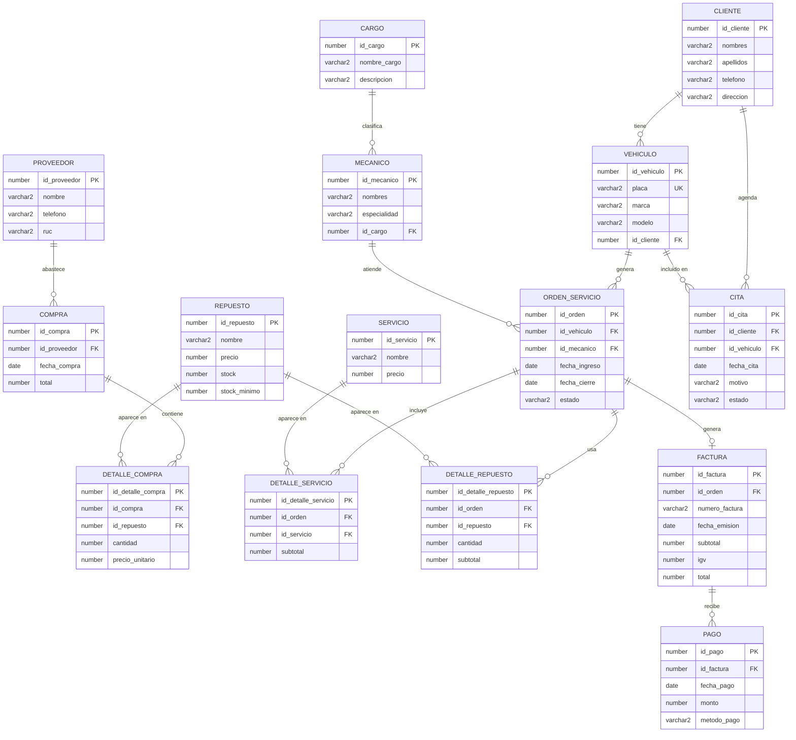

# Diagrama ER — Sistema AUTOFIX

```mermaid
erDiagram

    CARGO {
        number  id_cargo     PK
        varchar2 nombre_cargo
        varchar2 descripcion
    }

    CLIENTE {
        number  id_cliente PK
        varchar2 nombres
        varchar2 apellidos
        varchar2 telefono
        varchar2 direccion
    }

    MECANICO {
        number  id_mecanico  PK
        varchar2 nombres
        varchar2 especialidad
        number  id_cargo     FK
    }

    SERVICIO {
        number  id_servicio PK
        varchar2 nombre
        number  precio
    }

    REPUESTO {
        number  id_repuesto  PK
        varchar2 nombre
        number  precio
        number  stock
        number  stock_minimo
    }

    VEHICULO {
        number  id_vehiculo PK
        varchar2 placa      UK
        varchar2 marca
        varchar2 modelo
        number  id_cliente  FK
    }

    PROVEEDOR {
        number  id_proveedor PK
        varchar2 nombre
        varchar2 telefono
        varchar2 ruc
    }

    COMPRA {
        number  id_compra    PK
        number  id_proveedor FK
        date    fecha_compra
        number  total
    }

    DETALLE_COMPRA {
        number id_detalle_compra PK
        number id_compra         FK
        number id_repuesto       FK
        number cantidad
        number precio_unitario
    }

    ORDEN_SERVICIO {
        number  id_orden      PK
        number  id_vehiculo   FK
        number  id_mecanico   FK
        date    fecha_ingreso
        date    fecha_cierre
        varchar2 estado
    }

    DETALLE_SERVICIO {
        number id_detalle_servicio PK
        number id_orden            FK
        number id_servicio         FK
        number subtotal
    }

    DETALLE_REPUESTO {
        number id_detalle_repuesto PK
        number id_orden            FK
        number id_repuesto         FK
        number cantidad
        number subtotal
    }

    FACTURA {
        number  id_factura     PK
        number  id_orden       FK
        varchar2 numero_factura
        date    fecha_emision
        number  subtotal
        number  igv
        number  total
    }

    PAGO {
        number  id_pago     PK
        number  id_factura  FK
        date    fecha_pago
        number  monto
        varchar2 metodo_pago
    }

    CITA {
        number  id_cita     PK
        number  id_cliente  FK
        number  id_vehiculo FK
        date    fecha_cita
        varchar2 motivo
        varchar2 estado
    }

    CARGO          ||--o{ MECANICO         : "clasifica"
    CLIENTE        ||--o{ VEHICULO         : "tiene"
    CLIENTE        ||--o{ CITA            : "agenda"
    VEHICULO       ||--o{ ORDEN_SERVICIO   : "genera"
    VEHICULO       ||--o{ CITA            : "incluido en"
    MECANICO       ||--o{ ORDEN_SERVICIO   : "atiende"
    PROVEEDOR      ||--o{ COMPRA          : "abastece"
    COMPRA         ||--o{ DETALLE_COMPRA  : "contiene"
    REPUESTO       ||--o{ DETALLE_COMPRA  : "aparece en"
    ORDEN_SERVICIO ||--o{ DETALLE_SERVICIO : "incluye"
    ORDEN_SERVICIO ||--o{ DETALLE_REPUESTO : "usa"
    ORDEN_SERVICIO ||--o| FACTURA         : "genera"
    SERVICIO       ||--o{ DETALLE_SERVICIO : "aparece en"
    REPUESTO       ||--o{ DETALLE_REPUESTO : "aparece en"
    FACTURA        ||--o{ PAGO            : "recibe"
```
